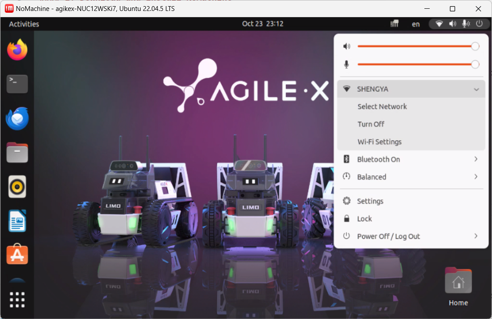
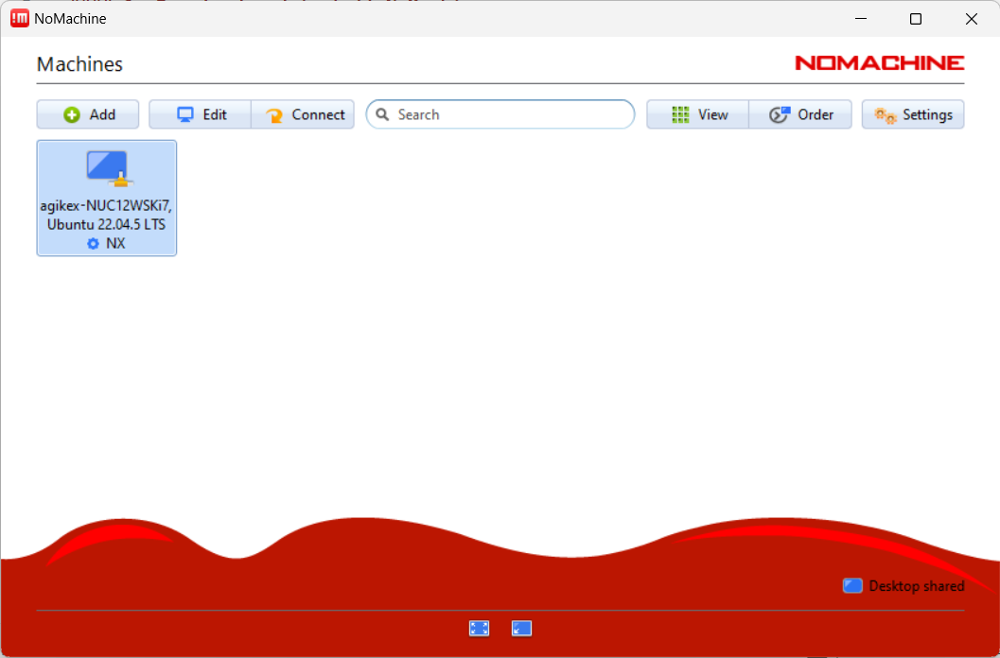
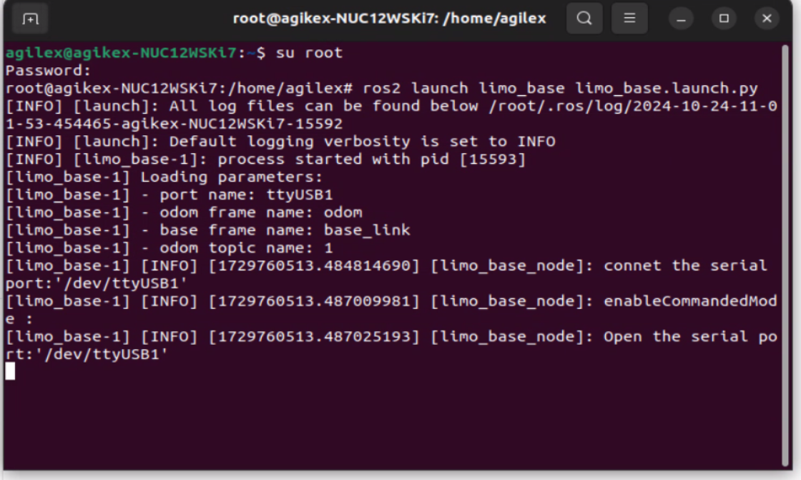
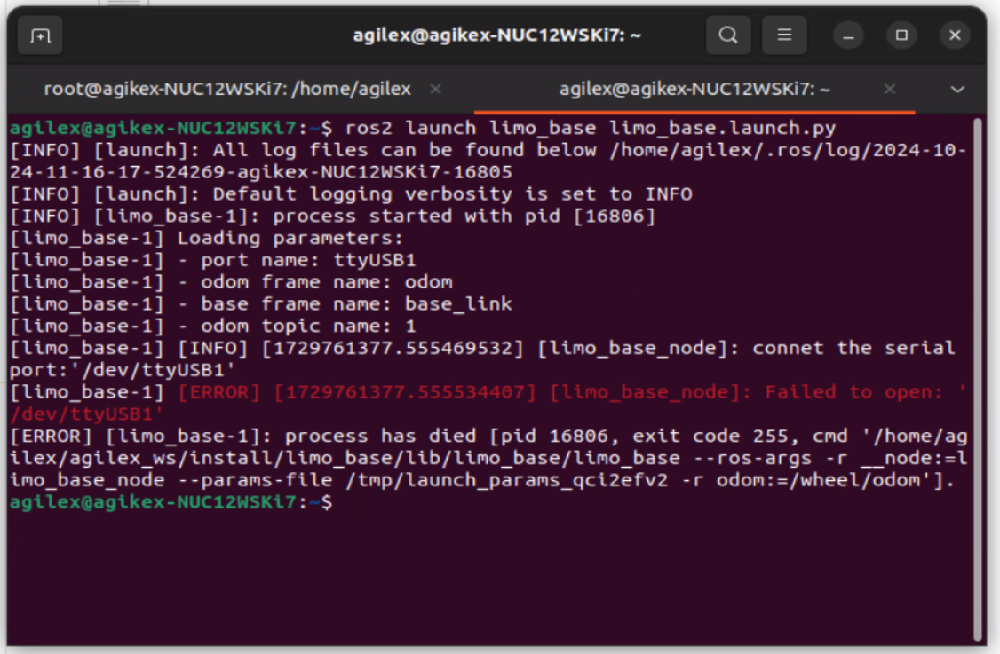

## Remote desktop connection
#### 1. Download and install NoMachine

First download the corresponding software on personal computer. 

Download link: https://www.nomachine.com/download. 

Download the corresponding version according to your computer's operating system and architecture. Connect limo and computer to the same WIFI.             

#### 2. Connect to wifi

After the keyboard and mouse are successfully connected, select the wifi that needs to be connected.



#### 3. Connect to Limo remotely

Select connection object (double click)



<font color=blue>Username：agilex       

Password：agx </font>
 
Select to save the password.

Always select the default option : OK.


## Limo topic
In ROS 2, topic is a common communication mechanism used to transmit messages between ROS 2 nodes. It adopts a publish-subscribe (Publish-Subscribe) model, in which one node publishes messages to a specific topic, and other nodes subscribe to the topic to receive messages.

Start the Limo chassis driver:

```
ros2 launch limo_base limo_base.launch.py
```
## Launch keyboard control node.
```
ros2 run teleop_twist_keyboard teleop_twist_keyboard 
```


## How to use LiDAR
Launch a new terminal and enter the command:

```
ros2 launch ydlidar_ros2_driver ydlidar.launch.py
```
### Navigation

## 1 . LiDAR Mapping :  need a map prebuild , so we get that by using lidar

# Cartographer mapping
First, start the LiDAR. Launch a new terminal and enter the command:

```
ros2 launch limo_bringup limo_start.launch.py
```

Then start the cartographer mapping algorithm. Open another new terminal and enter the command:

```
ros2 launch limo_bringup limo_cartographer.launch.py
```

## 2.  Rtabmap algorithm navigation : We use that map that build in step 1 to navigation 
> **Note:** Before running the command, please make sure that the programs in other terminals have been terminated. The termination command is: Ctrl+c.

（1）First launch the LiDAR. Enter the command in the terminal:

```
ros2 launch limo_bringup limo_start.launch.py
```

（2）Launch the camera. Enter the command in the terminal:

```
ros2 launch astra_camera dabai.launch.py
```

（3）Start the mapping mode of rtabmap algorithm. Enter the command in the terminal:

```
ros2 launch limo_bringup limo_rtab_rgbd.launch.py localization:=true
```

（4）Start the navigation algorithm. Enter the command in the terminal:

```
ros2 launch limo_bringup limo_rtab_nav2.launch.py
```

## Chassis Driver File

The mobile chassis needs to be driven by a program to achieve the navigation of Limo.  
The chassis driver of Limo only has the C++ version at the moment.

### Driver file structure

The folder where the chassis driver is located is ~/agilex_ws/src/limo_ros2/limo_base. Enter this folder through the following command.

```
cd ~/agilex_ws/src/limo_ros2/limo_base
```

| **Folder** | **Stored files**                   |
| ---------- | ---------------------------------- |
| include    | Library files called by the driver |
| launch     | Startup files of the driver        |
| msg        | Message files needed by the driver |
| src        | Driver C++ source code             |
| scripts    | Python code                        |
| action     | action message files               |
| srv        | server message files               |

#### Start the Limo chassis driver:
**Note:** Before running the command, please make sure that the programs in other terminals have been terminated. The termination command is: Ctrl+c

(1) Get the root. 
    Enter the command in the terminal:

```
su root
```
(2) Input the password

```
agx
```
(3) Run the following command to start Limo chassis driver

```
ros2 launch limo_base limo_base.launch.py
```


**Without root, there is a error about USB port, as shown in the following**


### 

You can control the forward movement of limo with a simple command.

1. Launch the chassis, open a terminal, and enter the command in the terminal:

```
ros2 launch limo_base limo_base.launch.py
```

2. Launch keyboard control node:

```
ros2 run teleop_twist_keyboard teleop_twist_keyboard 
```
Note: When the vehicle cannot go straight in Ackermann mode, the steering gear calibration is required.


#### Start the Navigation

```
ros2 launch limo_bringup navigation_launch.py
```


### Build - and test HUY package 
```
colcon build --packages-select limo_nav_huy_test
```
run the scritp
```
ros2 launch limo_bringup limo_start.launch.py
```

```
ros2 launch limo_bringup limo_nav2_diff.launch.py
```

```
ros2 run limo_nav_huy_test wandering
```

